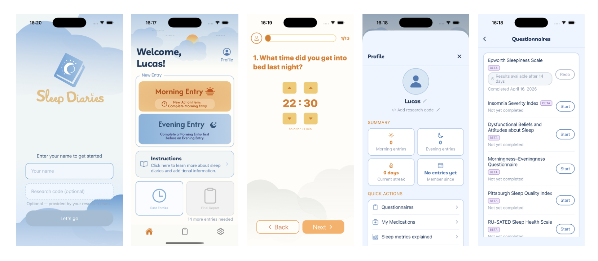

# 🌙 Sleep Diaries


An open-source, research-grade sleep diary app built with React Native and Expo. Available on **iOS**, **Android**, and the **web**. Designed to be easily tailored by researchers, clinicians, and developers for their own sleep studies and clinical needs.

🌐 **Web app:** _link coming soon_

---

## 📖 What is Sleep Diaries?

Sleep Diaries is a cross-platform app (iOS, Android, and web) that guides users through structured morning and evening questionnaires to track their sleep patterns over time. It is based on consensus sleep diary methodology used in clinical sleep research.

The app is intentionally simple and modular — the question sets, input types, themes, and data storage can all be customised without touching the core navigation or UI logic.

---

## ✨ Features

- 🌅 **Morning entry** — 13-question diary covering bedtime, sleep onset, night wakings, final awakening, sleep quality, and restedness
- 🌙 **Evening entry** — 5-question diary covering naps, caffeine, exercise, and medication
- ⏱️ **Rich input types** — 24-hour time stepper, duration stepper, yes/no, 1–5 rating scale, number counter, medication tracker, and free text
- 🔀 **Conditional questions** — follow-up questions appear automatically based on previous answers
- 🎨 **Dual themes** — amber for morning entries, blue for evening entries
- 💾 **Local persistence** — all entries saved to device storage via AsyncStorage
- 📋 **Past entries** — scrollable history grouped by date with expandable answer cards
- 📊 **Final report** — auto-unlocks after 3 morning entries, computes sleep metrics
- 📤 **Data export** — CSV and JSON export via native share sheet
- 🔔 **Push notifications** — daily 8am and 9pm reminders
- ⚙️ **Settings** — notifications toggle, text-to-speech, language, account management
- 📱 **iOS & Android** — single codebase via React Native + Expo
- 🌐 **Web** — responsive web app hosted via Netlify, constrained to a mobile-phone layout on desktop

---

## 📱 Screens



---

## 🗂️ Project Structure

```
SleepDiaries/
├── app/                        # expo-router file-based navigation
│   ├── _layout.jsx             # Root stack navigator
│   ├── index.jsx               # Onboarding / name entry screen
│   ├── questionnaire.jsx       # Step-by-step questionnaire (morning or evening)
│   ├── past-entries.jsx        # Scrollable entry history
│   ├── final-report.jsx        # Sleep metrics summary report
│   ├── export.jsx              # CSV / JSON data export
│   └── (tabs)/                 # Tab bar screens
│       ├── _layout.jsx         # Tab bar configuration
│       ├── home.jsx            # Home screen
│       ├── entry.jsx           # Entry type chooser
│       └── settings.jsx        # Settings
├── data/
│   └── questions.js            # ⭐ All question definitions — start here to customise
├── storage/
│   ├── storage.js              # AsyncStorage helpers + CSV/JSON export
│   └── notifications.js        # Push notification scheduling
├── assets/                     # App icons and splash screen
├── app.json                    # Expo configuration
├── babel.config.js             # Babel configuration
└── package.json                # Dependencies
```

---

## 🚀 Getting Started

### Prerequisites

- [Node.js](https://nodejs.org/) v18 or later
- [Expo CLI](https://docs.expo.dev/get-started/installation/)
- [Expo Go](https://expo.dev/client) on your phone, or Xcode (iOS simulator) / Android Studio (Android emulator)

### Installation

```bash
# Clone the repository
git clone https://github.com/circadia-bio/SleepDiaries.git
cd SleepDiaries

# Install dependencies
npm install

# Start the development server
npx expo start
```

Then press `i` for iOS simulator, `a` for Android emulator, or scan the QR code with Expo Go on your phone.

### Running on web (development)

```bash
npx expo start --web
```

### Deploying to the web (Netlify)

```bash
# Export the web build
npx expo export -p web --output-dir docs --clear

# Run the deploy script (handles font paths and redirects)
npm run deploy
```

Then drag the `docs/` folder to [Netlify Drop](https://app.netlify.com/drop), or connect your repository for automatic deployments.

🌐 **Live web app:** _link coming soon_

---

## 🔧 Customising the Question Set

All questions are defined in a single file: **`data/questions.js`**

Each question is a plain JavaScript object with a `type` field that controls how it renders. To add, remove, or reorder questions, simply edit this file — no other changes are needed.

### Question object structure

```js
{
  id: 'mq1',              // Unique identifier (used for conditional logic)
  number: 1,              // Display number shown on screen
  text: 'Question text',  // The question shown to the user
  type: 'time',           // Input type (see below)
  defaultValue: { ... },  // Optional starting value
  optional: true,         // If true, user can skip without answering
}
```

### Available input types

| Type | Description | Use for |
|------|-------------|---------|
| `time` | 24-hour hour:minute stepper | Bedtime, wake time |
| `duration` | Hours + minutes stepper | Time to fall asleep, nap length |
| `yes_no` | Large Yes / No buttons | Binary questions |
| `rating` | 1–5 labelled option buttons | Sleep quality, restedness |
| `number` | +/- counter with unit label | Number of drinks, wake-ups |
| `medication` | Add/edit/delete entries with dose and time | Medication tracking |
| `text_input` | Multiline free text | Comments, notes |

### Conditional (follow-up) questions

```js
// Parent question
{
  id: 'mq4',
  text: 'Did you wake up during the night?',
  type: 'yes_no',
  followUp: 'mq4b',
},

// Follow-up — only shown if mq4 === 'yes'
{
  id: 'mq4b',
  text: 'How many times did you wake up?',
  type: 'number',
  conditionalOn: { id: 'mq4', value: 'yes' },
},
```

---

## 🎨 Customising Themes

The morning/evening colour themes are defined at the top of `app/questionnaire.jsx`:

```js
const THEME = {
  morning: {
    primary:      '#E07A20',   // Amber — buttons, text, progress bar
    primaryLight: '#F5C96A',   // Light amber — stepper backgrounds
    progressBg:   '#F5DEB3',
    background:   '#FDFAF5',
    cardBg:       '#FFF8EE',
  },
  evening: {
    primary:      '#2A6CB5',   // Blue
    primaryLight: '#7EB0E0',
    progressBg:   '#C8DFF5',
    background:   '#F5F9FF',
    cardBg:       '#EEF5FF',
  },
};
```

---

## 🗺️ Navigation Architecture

The app uses [expo-router](https://expo.github.io/router/) with file-based routing:

```
index.jsx           → Onboarding (shown on first launch, skipped if name saved)
(tabs)/home         → Main home screen
(tabs)/entry        → Entry type chooser
(tabs)/settings     → Settings
questionnaire       → Full-screen questionnaire (slides up, hides tab bar)
past-entries        → Entry history
final-report        → Sleep metrics report
export              → CSV / JSON export
```

---

## 💾 Data Storage

All data is stored locally on the device using `@react-native-async-storage/async-storage`. No data is sent to any server.

```js
// Stored keys:
// 'user_name'  → participant name string
// 'entries'    → JSON array of entry objects

// Entry structure:
{
  id: '2024-01-15-morning',
  type: 'morning',
  date: '2024-01-15',
  completedAt: '2024-01-15T08:32:00Z',
  answers: {
    mq1: { hour: 22, minute: 30 },
    mq4: 'yes',
    mq4b: 2,
    mq11: 4,
    // ...
  }
}
```

---

## 🔬 Research Use

This app implements the **Consensus Sleep Diary (CSD)** — a standardised instrument for clinical and research settings. The morning questions cover:

- Sleep onset latency
- Number and duration of night wakings
- Early morning awakening
- Total sleep time (computed)
- Sleep efficiency (computed)
- Sleep quality and restedness

### Final report metrics

The final report (unlocked after 3 morning entries) automatically computes:

| Metric | Formula |
|--------|---------|
| Total sleep time | Time in bed − sleep onset latency − WASO |
| Sleep efficiency | Total sleep time ÷ time in bed × 100% |
| Sleep onset latency | Average time to fall asleep |
| WASO | Wake after sleep onset |
| Sleep quality | Average of 1–5 ratings |
| Restedness | Average of 1–5 ratings |

### Adapting for your study

1. **Edit `data/questions.js`** to add, remove, or reorder questions
2. **Add new input types** in `app/questionnaire.jsx`
3. **Change the unlock threshold** — edit `MIN_ENTRIES_FOR_REPORT` in `app/final-report.jsx`
4. **Connect a backend** — replace the `AsyncStorage` calls in `storage/storage.js` with API calls

---

## 👥 Authors

**Northumbria University — Circadia Lab**

| Role | Names |
|------|-------|
| Principal Investigators | Lucas França, Mario Leocadio-Miguel |
| Development | Lucas França |
| Design | Bri Baehl, Jacob Howard, Frederic Kussow, Yuliana Luna Colón |

---

## 🎨 Design Acknowledgement

The app design was created by exchange students — Bri Baehl, Jacob Howard, Frederic Kussow, and Yuliana Luna Colón — during the **7th Annual Digital Civics Exchange (DCX)**, an international programme connecting students across disciplines to co-design civic technologies.

🌐 [dcx.events](https://www.dcx.events/home)

---

## 🤖 AI Acknowledgement

Development of this app was assisted by **Claude** (Anthropic's AI assistant). Claude helped scaffold the React Native codebase, implement navigation, build the questionnaire engine, set up local storage, push notifications, data export, and the final report.

---

## 🤝 Contributing

Contributions are welcome. If you are adapting this for a research study and want to share improvements back, please open a pull request.

1. Fork the repository
2. Create a feature branch (`git checkout -b feat/my-feature`)
3. Commit your changes (`git commit -m '✨ feat: add my feature'`)
4. Push to the branch (`git push origin feat/my-feature`)
5. Open a Pull Request

---

## 📦 Dependencies

| Package | Version | Purpose |
|---------|---------|---------|
| `expo` | ~55.0.0 | Core Expo SDK |
| `expo-router` | ~55.0.0 | File-based navigation |
| `react-native` | 0.83.2 | Cross-platform mobile framework |
| `react` | 19.2.0 | React framework |
| `@expo/vector-icons` | ^15.0.2 | Ionicons icon set |
| `@react-native-async-storage/async-storage` | 2.2.0 | Local data persistence |
| `expo-notifications` | ~55.0.0 | Push notification reminders |
| `expo-status-bar` | ~55.0.0 | Status bar control |
| `react-native-paper` | ^5.12.0 | UI component library |
| `react-native-safe-area-context` | 5.6.2 | Safe area handling |
| `react-native-screens` | 4.23.0 | Native screen management |
| `babel-preset-expo` | ~55.0.0 | Babel transpilation |

---

## 📄 Licence


Copyright © Circadia Lab — Lucas França & Mario Leocadio-Miguel

Released under the [MIT License](./LICENSE).

Design by Bri Baehl, Jacob Howard, Frederic Kussow, and Yuliana Luna Colón.

---

## 🏗️ Roadmap

- [x] Persist answers with AsyncStorage
- [x] Show name entered at onboarding on home screen
- [x] Past entries screen with history view
- [x] Final report with sleep metrics
- [x] Push notification reminders (morning + evening)
- [x] Data export (CSV / JSON)
- [x] Web app (Netlify)
- [ ] Backend API integration
- [ ] Multi-language support
